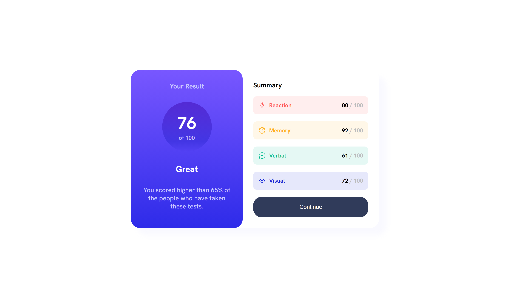
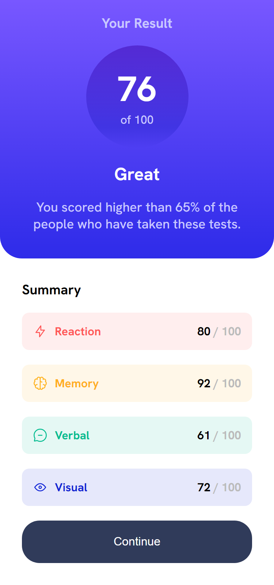

# Frontend Mentor - Results summary component solution

This is a solution to the [Results summary component challenge on Frontend Mentor](https://www.frontendmentor.io/challenges/results-summary-component-CE_K6s0maV). Frontend Mentor challenges help you improve your coding skills by building realistic projects. 

## Table of contents

- [Overview](#overview)
  - [The challenge](#the-challenge)
  - [Screenshot](#screenshot)
  - [Links](#links)
- [What I learned](#what-i-learned)

## Overview

### The challenge

Users should be able to:

- View the optimal layout for the interface depending on their device's screen size
- See hover and focus states for all interactive elements on the page

### Screenshots

#### Desktop


#### Mobile


### Links

- Solution URL: https://github.com/ESLB/results-summary-component-main
- Live Site URL: https://eslb.github.io/results-summary-component-main/

## What I learned

Animations, specially how to apply an animation to a child element when the father is been hovered
```css
@keyframes shake {
  0% { transform: translate(0px, 0px) rotate(0deg); }
  10% { transform: translate(0px, -8px) rotate(0deg); }
  25% { transform: translate(-5px, -8px) rotate(-1deg); }
  50% { transform: translate(5px, -8px) rotate(1deg); }
  75% { transform: translate(-5px, -8px) rotate(-1deg); }
  90% { transform: translate(0px, -8px) rotate(0deg); }
  100% { transform: translate(0px, -0px) rotate(-1deg); }
}
.item:hover img {
  animation: shake 0.35s;
}
```
Background color gradient
```css
button:active {
  background: rgb(120, 87, 255);
  background: linear-gradient(180deg, rgb(120, 87, 255) 0%, rgb(46, 43, 233) 100%);
}
```